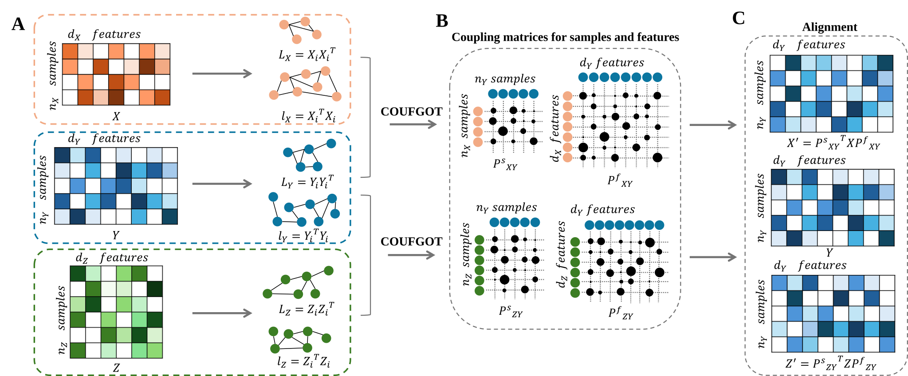

# COUFGOT

Official implementation of:

**Single-Cell Multi-Omics Data Alignment and TranslationBased on CO-Unbalanced Filter Graph Optimal Transport**

---

## Overview

COUFGOT is a unified optimal transport framework for single-cell multi-omics integration. The framework combines Unbalanced Optimal Transport (UOT), covariance-based structural modeling, and collaborative optimization to support:

* Vertical Alignment
* Diagonal Alignment
* Cross-modal Translation

The method is evaluated on multiple RNA–ATAC and RNA–ADT datasets from public single-cell multimodal benchmarks.

---

## Framework

<p align="center">

</p>

---

## Repository Structure

```text
COUFGOT
│
├── main_COUFGOT/
│   ├── crossmo_main.py
│   ├── diag_main.py
│   ├── vertical_main_samp.py
│   ├── train_test.py
│   └── model/
│
├── data/
│   └── Supplementary Table.xlsx
│
├── requirements.txt
└── README.md
```

---

## Installation

Create environment:

```bash
conda create -n coufgot python=3.12

conda activate coufgot
```

Install dependencies:

```bash
pip install -r requirements.txt
```

---

## Datasets

The datasets used in this work are publicly available from the single-cell multimodal benchmark resource.

Dataset information and accession numbers are provided in:

```text
data/Supplementary Table.xlsx
```

All processed datasets used in the experiments are provided in the `master` branch under the `data/` directory.

### Dataset Directory

```text
data/
├── vertical/
├── diagonal/
└── crossmo/
```

---

## Running COUFGOT

### Vertical Alignment

```bash
python vertical_main_samp.py
```

### Diagonal Alignment

```bash
python diag_main.py
```

### Cross-modal Translation

```bash
python crossmo_main.py
```

---

## Citation

If this tool is helpful for your research, please cite COUFGOT.

---
